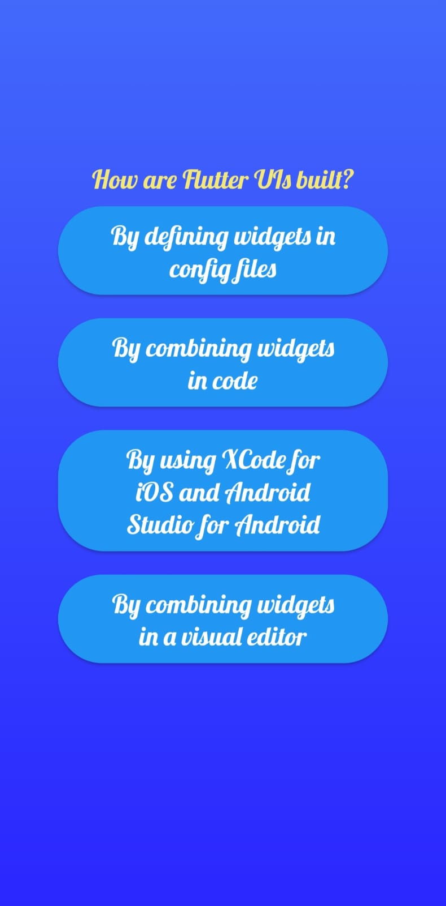
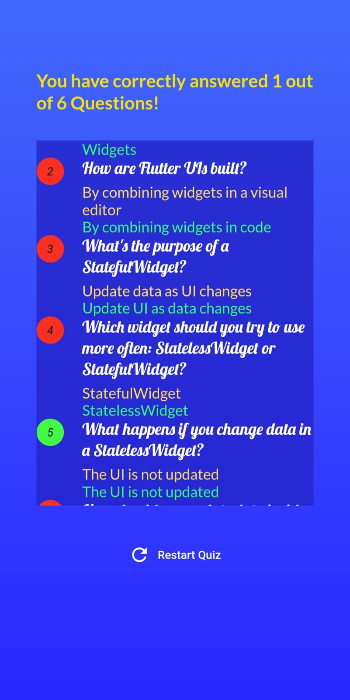

# Flutter Quiz App

The Flutter Quiz App is a simple quiz application designed to test your knowledge of the fundamentals of Flutter, a popular framework for building cross-platform applications. This app features multiple-choice questions (MCQs) related to Flutter concepts. After completing the quiz, you can view your result statistics, including the number of correct and incorrect answers. You also have the option to restart the quiz and challenge yourself to improve your score.

## Getting Started
To get started with the Flutter Quiz App, follow these steps:

### 1.Clone the Repository:
Clone this repository to your local machine using git clone.

### 2.Flutter Setup:
Make sure you have Flutter installed on your machine. If not, follow the official Flutter installation guide to set up Flutter.

### 3.Navigate to the Project Directory:
Open a terminal and navigate to the project directory using cd flutter-quiz-app.

### 4.Install Dependencies:
Run flutter pub get to install the app's dependencies.

## Usage

## 1.Launch the App:
Run the app using flutter run from the project directory.

## 2.Answer Quiz Questions:
The app will present you with a set of multiple-choice questions about Flutter fundamentals. Choose the correct answer by tapping on one of the options.

## 3.Submit Answers: 
After answering all the questions, tap the "Submit" button to see your result statistics.

## 4.View Result:
You will be shown the number of correct and incorrect answers. Use this feedback to assess your knowledge.

## 5.Restart Quiz:
If you'd like to retake the quiz, tap the "Restart Quiz" button at the bottom of the result screen.

## Result Statistics
After submitting your quiz answers, you will see a screen displaying your result statistics:  
Number of Correct Answers  
Number of Incorrect Answers  
Use these statistics to gauge your understanding of Flutter concepts and areas that might need further exploration.

## Restarting the Quiz
If you wish to retake the quiz, tap the "Restart Quiz" button at the bottom of the result screen. This will allow you to challenge yourself and improve your score.

## Contributions
Contributions to the Flutter Quiz App are welcome! If you have suggestions for additional quiz questions, improvements to the user interface, or bug fixes, feel free to fork this repository and submit a pull request.

Thank you for using the Flutter Quiz App! Test your knowledge of Flutter and have fun learning more about this powerful framework. If you encounter any issues or have feedback, please don't hesitate to reach out.

contact:2005ashutoshshukla@gmail.com
